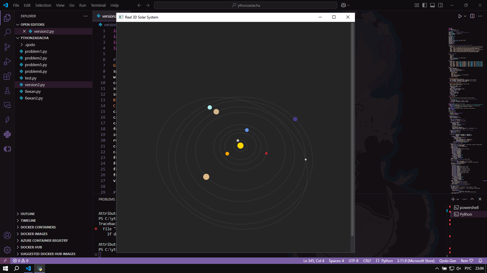

# Solar System Simulation



A 3D simulation of the solar system using DearPyGui.

## Author
encptr

## Features
- Realistic 3D solar system simulation
- Accurate planetary orbits and movements
- Switch between 2D and 3D views
- Detailed planet information
- Interactive camera controls

## Installation
```bash
pip install -r requirements.py
```

## Controls
| Key | Function |
|-----|----------|
| T | Toggle between 2D and 3D view |
| C | Switch between orbit and free camera modes |
| + | Increase simulation speed |
| - | Decrease simulation speed |
| 1-9 | Select planet for information |
| W/A/S/D | Move camera in free mode |
| Arrow Keys | Rotate camera in orbit mode |

## Usage
1. Install required libraries
2. Run the simulation:
```bash
python SolarSystem.py
```
3. Use controls to explore the solar system

## Bugs
1. Window may freeze , just restart
2. Control is reversed except ↑ and ↓
